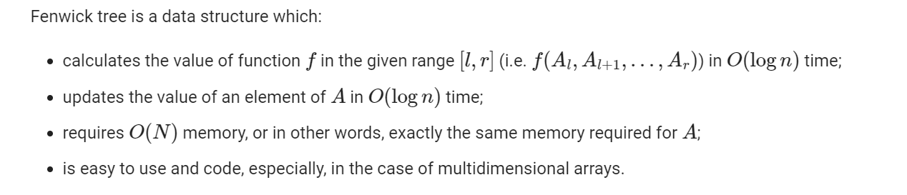
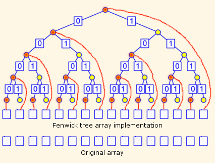

# Fenwick Tree

Fenwick tree is also called **Binary Indexed Tree**, or just BIT abbreviated.

## Description

__Fenwick Tree / Binary indexed tree (BIT)__ is a data structure used to process interval/range based queries. Compared to segment tree data structure, Fenwick tree uses less space and is simpler to implement.
One disadvantage of Fenwick tree is that it can be only used with an operation that is invertible.

## Implementations

The two important implementations of Fenwick Tree are:

* Least Significant Bit Operation
* Querying an Interval
* Updating array at index 

Fenwick tree is typically implemented as an array and is indexed using bits of integer keys. These integer keys fall in range [1...n], skipping 0.
Let ft[] be the array representing Fenwick tree. Then the element ft[i] is responsible for the range [(i - LSB(i) + 1) ... i].
This feature is used to build up the Fenwick tree and so it can be seen that Fenwick tree is a multi-way tree.

##### Note

**_The basic idea behind Fenwick tree is that since any integer can be represented as sum of powers of 2, we can represent cumulative frequencies as sum of non-overlapping sub-frequencies._**

