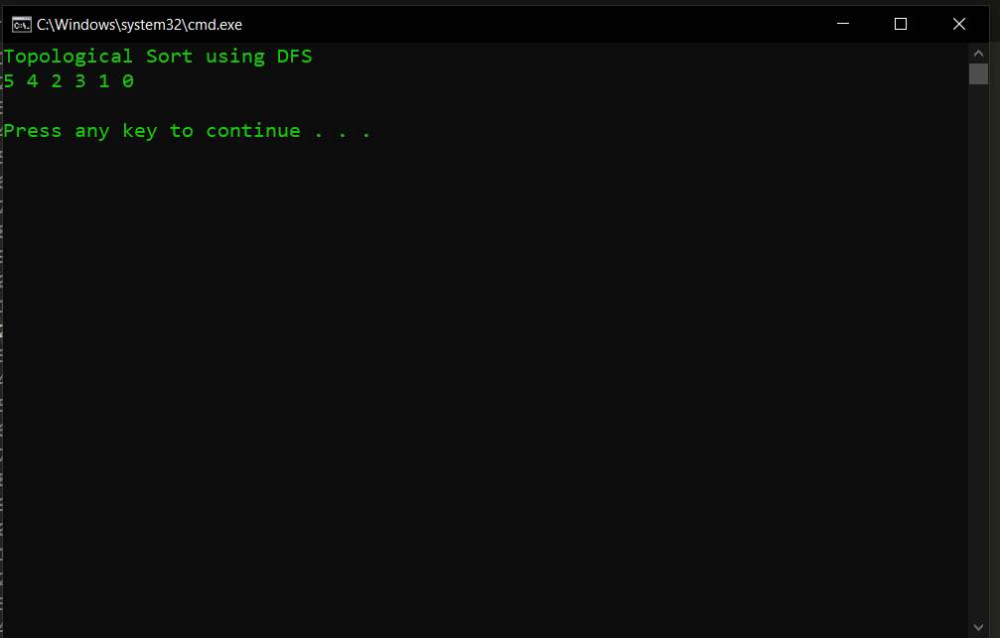
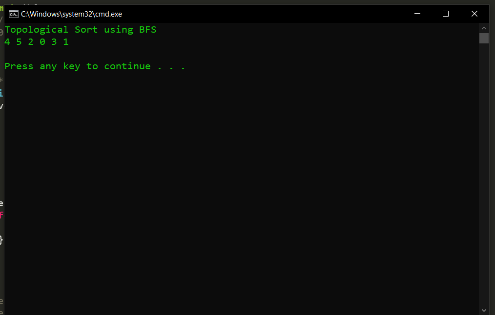

# Topological Sorting]
[Topological Sorting](https://www.geeksforgeeks.org/all-topological-sorts-of-a-directed-acyclic-graph/)

Topological sorting for Directed Acyclic Graph (DAG) is a linear ordering of vertices such that for every directed edge u v, vertex u comes before v in the ordering. Topological Sorting for a graph is not possible if the graph is not a DAG.

## Topological Sorting using DSF
[Topological Sorting using DSF](https://www.geeksforgeeks.org/topological-sorting/)

Step 1: Create the graph by calling addEdge(a,b).

Step 2: Call the topologicalSort( )

Step 2.1: Create a stack and a boolean array named as visited[ ];

Step 2.2: Mark all the vertices as not visited i.e. initialize visited[ ] with 'false' value.

Step 2.3: Call the recursive helper function topologicalSortUtil() to store Topological Sort starting from all vertices one by one.

Step 3: def topologicalSortUtil(int v, bool visited[],stack<int> &Stack):

Step 3.1: Mark the current node as visited.

Step 3.2: Recur for all the vertices adjacent to this vertex.

Step 3.3: Push current vertex to stack which stores result.

Step 4: Atlast after return from the utility function, print contents of stack.

### My Output 
 

## Topological Sorting using BFS

[Topological Sorting using BFS](https://www.geeksforgeeks.org/topological-sorting-indegree-based-solution/?ref=lbp)

Step1: Create an adjacency list called graph

Step2: Call the topological_sorting() function

Step2.1: Create a queue and an array called indegree[]

Step2.2: Calculate the indegree of all vertices by traversing over graph

Step2.3: Enqueue all vertices with degree 0

Step3: While the queue is not empty repeat the below steps

Step3.1: Dequeue the element at front from the queue and push it into the solution vector

Step3.2: Decrease the indegree of all the neighbouring vertex of currently dequed element ,if indegree of any neigbouring vertex becomes 0 enqueue it.

Step3.3: Enqueue all vertices with degree 0.

Step4: If the queue becomes empty return the solution vector.

Step5: Atlast after return from the topological_sorting() function, print contents of returned vector.

### My Output

