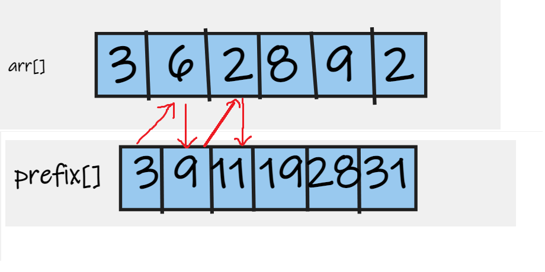

 Given an array of N integers. Given Q queries and in each query given L and R print sum of array elements from index L to R (both inclusive)

Constraints
1<=N<=10^5
1<=arr[i]<=10^9
1<=Q<=10^5
1<=L,R<=N

##### Naive Approach
Use a loop to calculate the sum of numbers from l to r for each query.

Time Complexity: O(N) + O(Q*N) = 10^ 10   
Space Complexity: O(1)

##### Optimial Approach

Use prefix sum , a pre-computation technique , to calculate the sum .

We declare a prefix[] array which stores the sum of numbers from 1 to ith index.
prefix[i] --->  Stores the sum of numbers from 1 to ith index

So, to calculate the sum of numbers from l to r , we deduce a formula:

prefix[r] ----> Stores sum of numbers from 1 to rth index
prefix[l-1] ----> Stores sum of numbers from 1 to (l-1)th index

So, to output the sum of numbers from l to r , we use this:   
prefix[r]-prefix[l-1]        (O(1) time complexity)

Time Complexity:  O(N) + O(N) + O(Q) =  10^5 
 Space Complexity: O(N)  + O(N) (Using prefix array)

